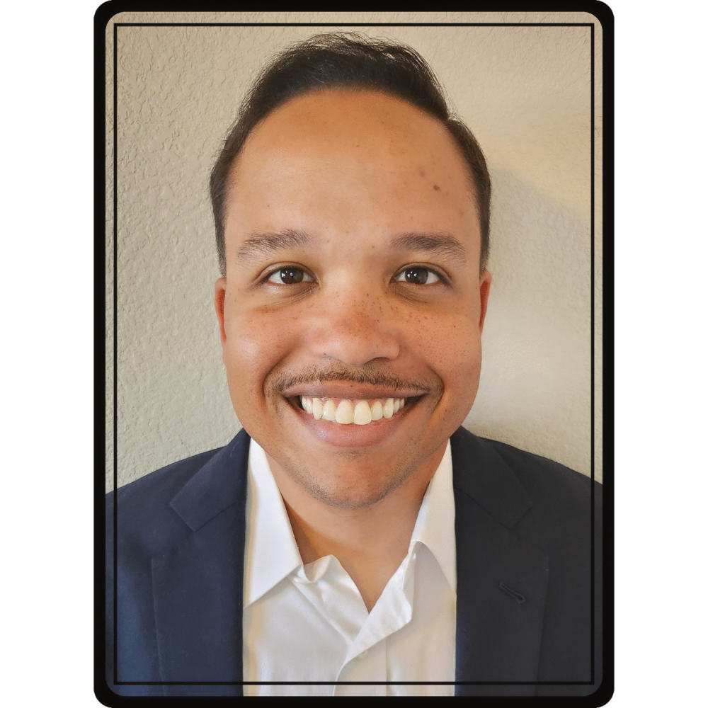

  

# David Offutt — Computer Science Portfolio

Welcome to my portfolio.

I am a Computer Science student and U.S. Army veteran pursuing a transition into software engineering and IT.  
This repository highlights selected projects demonstrating programming, networking, and problem-solving skills across multiple languages and technologies.

---

## Projects Overview

### [MathTutor_Java](https://github.com/doff87/MathTutor_Java)
A console-based Java program that helps students practice arithmetic operations with configurable difficulty and test mode.

### [Offutt_Playable_Zombie_Game](https://github.com/doff87/Zombie_Unity_Game)
A simple Unity-based zombie survival prototype showcasing player movement, enemy AI, and a basic HUD system.  
Built in C# with Unity’s physics and prefab systems to demonstrate game logic, design structure, and interactive UI fundamentals.

### [FullStack_Node_Postgres_App](https://github.com/doff87/FullStack_Node_Postgres_App)
A full-stack web application built with Node.js, Express, and PostgreSQL using Sequelize ORM.  
Includes REST API endpoints, HTML interfaces for managing game data, and a fully deployed cloud version using AWS EC2 and RDS.

---

## Skills Demonstrated

- Java, Python, C#, Unity
- Object-Oriented Programming (OOP)
- Linux & Windows Environments
- Git & GitHub for version control

---

## About Me

- Computer Science B.S. Student — Lake Washington Institute of Technology (Expected 2027)  
- 15+ years of leadership experience as a U.S. Army officer  
- Certified: CompTIA Network+ | AWS Cloud Practitioner  
- Based in Redmond, WA
- Email: david.offutt.do@gmail.com
- [Github User Account](https://github.com/doff87/)
- [LinkedIn Profile](https://www.linkedin.com/in/d-offutt/)

---

## Resume
You can download my resume here:
[Download Resume (PDF)](./resume.pdf)
